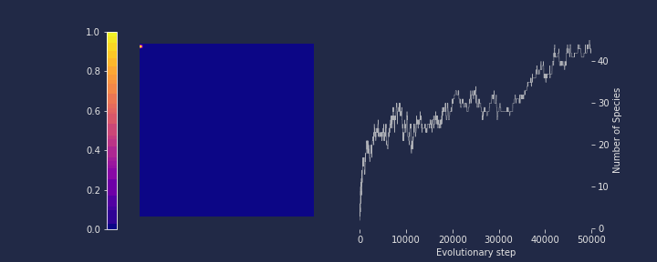
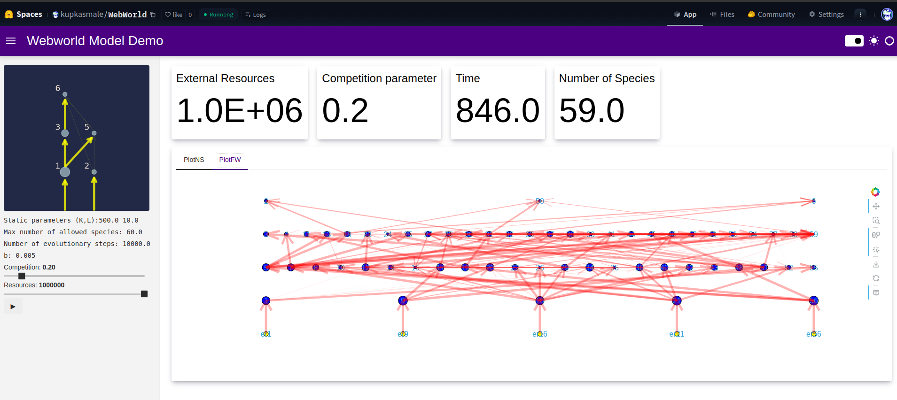

# Codes to carry out simulations of the Webworld Model.

This is a model of co-evolutionary dynamics described and thoroughly studied in the context of ecology, economics, coupling population dynamics, game theory and evolutionary innovation to investigate the conditions and properties for the formation of robust ecological communities.

Here is a list of relevant papers describing the model and key features:

1. *Modelling coevolution in multispecies communities* - 
[J. Theor. Biol.](https://doi.org/10.1006/jtbi.1998.0706) 

2. *The influence of predator–prey population dynamics on the long-term evolution of food web structure* - 
[J. Theor. Biol.](https://doi.org/10.1006/jtbi.2000.2203)
3. *The impact of nonlinear functional responses on the long-term evolution of food web structure* - 
[J. Theor. Biol.](https://doi.org/10.1016/j.jtbi.2004.04.033) 
4. *Modelling food webs* - [Handbook of Graphs and Networks: From the Genome to the Internet](https://doi.org/10.1002/3527602755.ch10)
5. *Topological structure and interaction strengths in model food webs* - 
[Ecol. Model.](https://doi.org/10.1016/j.ecolmodel.2004.12.018)
6. *The robustness of the Webworld model to changes in its structure* - 
[Ecological Complexity](https://doi.org/10.1016/j.ecocom.2007.06.012)

7. *The characteristics of species in an evolutionary food web model* -
[J. Theor. Biol.](https://doi.org/10.1016/j.jtbi.2008.02.028)

## Requisites.

This is a compact python implementation and  requires:

1. A python implementation >= 3.10.
2. Numpy, Numba, Pandas.

The two files `webworld.py` and `webworld_lib.py` are necessary to run the simulations. The former consists of the main simulation loops, whereas the latter contains the implementations of the necessary functions used to compute species, species features, score matrices, evolutionarily stable strategies as well as the population updates, species addition and removals.

To collect  the results and to further processing the function `save_matrices` should be invoked to save the arrays at the desired points in the evolution process. The last argument should be one of the set `BLOBS`, `ARRAY`, `ESS`. Which are destination folders, where the data will be written into. I use these names to store the data into corresponding to a specific time-scale. These folders should exists before the simulation is started.  

To specify the number of evolutionary events and the rest of the model parameters you must edit the `webworld.py` code. Specifically the lines:

```

#Maximum system size: Nsp
Nsp = 100;
#Traits Pool Size K  and Species Length
K = 500; L = 10; 
.
.
.

#INITIAL SETUP    
#Model Parameters: Resources:R
# Ecological Effciency: ld 
# F.response: b
# Competition parameter: c
R = 1e5; ld = 0.1; 
b = 5e-3; c = 0.5;
#Initial Population: No
#Minimum population allowed: Nd
No = 1.0; Nd = 1.0;
    
```
And the value `Ngen`. The simulation will run the specified number of `Ngen` time-steps or until the systems evolves a newtwork of size `Nsp`. The default values are 50000 and 100.

The code should run by executing:

```
>>> ./webworld.py
```

# Results and Visualisation.

The jupyter notebook `fwebs.ipynb` is provided to compute the foodweb structure and plot the results, shown below:



The foodweb structures should look like this.


# Webassembly - Panel version.

A live web-version of the code can be found if you click on the image below.

[](https://huggingface.co/spaces/kupkasmale/WebWorld)

The code is the same as the one provided here, but it should run in the browser. This version is limited to 60 species and 10000 evolutionary steps.

# More

A more detailed and fun discussion of the model and its implementation, as well as many other interesting topics on physics and simulation can be found on my [personal website](https://calugo.github.io/) 


